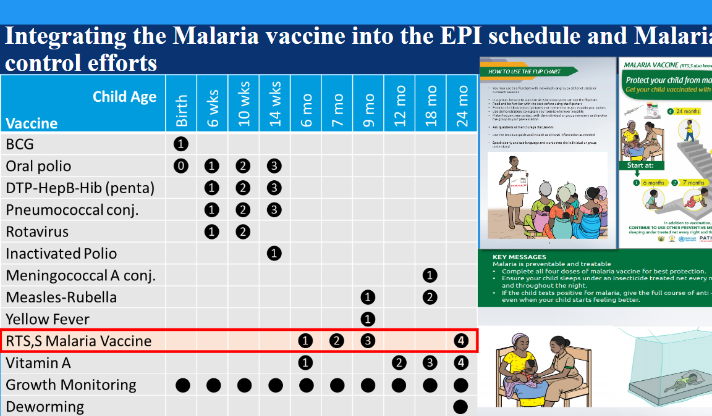
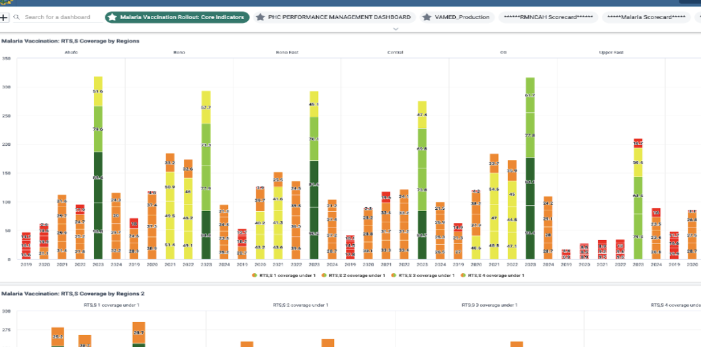
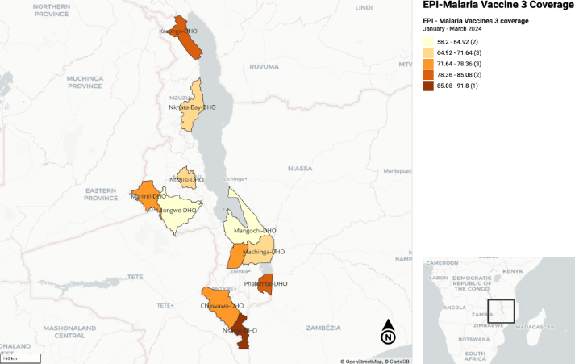
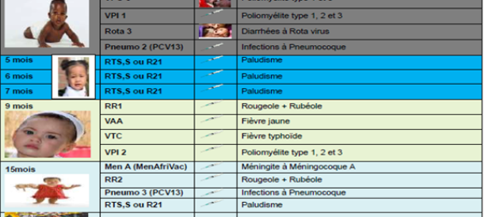
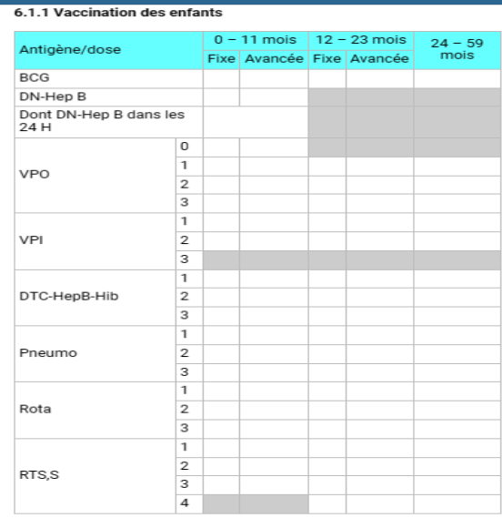

# Integrating Malaria Vaccination Data into DHIS2

The fight against malaria, a major cause of childhood illness and death in Africa, has taken a significant step forward with the introduction of two safe and effective malaria vaccines: RTS,S/AS01 and R21/Matrix-M. These vaccines, recommended by the WHO, have demonstrated a substantial impact, reducing malaria cases by over 50% in the first year following vaccination. With over 600,000 malaria-related deaths annually, including 450,000 child deaths, the deployment of these vaccines is a crucial component of a comprehensive strategy to combat malaria.

The unprecedented demand for malaria vaccines has led to rapid scale-up efforts, with at least 30 African countries planning to introduce these vaccines. Over 20 countries have already received Gavi support for rollout. To effectively manage and monitor the introduction of malaria vaccines, countries are leveraging DHIS2, a robust health information system widely used for routine immunization data management.

**Relevant DHIS2 Toolkits**:

To effectively monitor the impact of various health activities and vaccination efforts, it is crucial to utilize a comprehensive approach that encompasses surveillance, transmission control, and immunization. This triangulation ensures a robust framework for assessing and responding to health challenges. The DHIS2 toolkits on Malaria, IVM (Integrated Vector Management), and EPI (Expanded Programme on Immunization) are designed to support these efforts with precision and efficiency. Each toolkit offers specific functionalities that enhance data management, planning, and operational execution, ultimately contributing to improved health outcomes.

- **EPI**: Surveillance, stock management, microplanning, and campaigns.
- **Malaria**: Elimination and burden reduction, stock management, data quality, and district dashboards for monitoring.
- **IVM**: IRS residual efficacy monitoring and campaigns, ITN bioefficacy, and distribution campaigns.
- **Entomology**: Breeding sites monitoring and larviciding activities.

## General considerations and best practices

When integrating new components into existing modules or adding new modules to monitor emerging health program additions, it is essential to consider several key factors. These considerations ensure seamless integration, maintain data integrity, and enhance the overall effectiveness of the health information system. The points below outline critical aspects to keep in mind during this process, helping to facilitate a smooth transition and robust monitoring of new health initiatives.

**Instance Development**
- Aggregate monthly reports: Set up a new instance or update an existing one in DHIS2 to include malaria vaccination data. This involves configuring the backend systems to handle new data inputs and ensuring compatibility with existing data structures.
- Tracker data: Similar to the monthly report instance, set up a dedicated tracker instance within DHIS2 or update the existing instance hosting the EIR to support the integration of the new metadata and clients. This involves configuring the system to track individual vaccination records and manage follow-ups.

**Creation of Data Elements**
- Aggregate monthly reports: Define and create specific data elements that will capture all necessary information about the malaria vaccine. This includes details like vaccine type, doses administered, and age groups targeted.
- Tracker data: Define and create detailed data elements for tracking purposes. This includes fields for individual identifiers, vaccination dates and calendars (especially if alignment with the existing calendars is needed), dose numbers, follow-up schedules, and eventual reminders.

**Form Update or Creation**
Tailor the forms to meet the specific needs of the vaccination program and the existing work and data flows. Customization can involve adding user-friendly features, ensuring the form's layout is intuitive, and making sure it collects all required data efficiently.
- Aggregate monthly reports: Update existing vaccination forms to include new fields for the malaria vaccine data. If the existing forms are not adaptable, create new forms or sections within the existing forms specifically designed to capture malaria vaccine information accurately.
- Tracker data: Organize a configuration workshop to develop a new tracking form or adapt the existing data and workflow to accommodate the new metadata. This form will be used by healthcare workers to input detailed information about each vaccination event, ensuring comprehensive data capture

**Form Assignment**
Assign the updated or new forms appropriately within the DHIS2 system. This involves ensuring that the right users and facilities have access to these forms and are trained on how to use them.
- Tracker data: Appropriately assign the tracking form to relevant healthcare facilities and users - especially important if the implementation is not at a national scale and only involves a certain number of facilities. Ensure that only authorized personnel have access to the tracking data to maintain data integrity and confidentiality.

**Dashboard Creation/Update**
Update existing dashboards to reflect the new malaria vaccination data. If needed, create new dashboards that can provide visual representations of the data, such as coverage rates, geographical distribution, and age-specific vaccination rates. Develop dashboards that provide real-time insights into vaccination progress. These dashboards can display metrics like the number of doses administered, adverse event reports, and overall coverage rates, helping to monitor the vaccination activities efforts and effectiveness.

**Training**
Conduct thorough training sessions for users on the monthly reports or new tracking system, and dashboards. Training should cover how to input data correctly, generate reports, and use dashboards to analyze the data effectively.

## Country examples

The following section highlights the experiences of Ghana, Malawi, and Burkina Faso in integrating malaria vaccination data into their national DHIS2 systems. These case studies provide valuable insights into the practical steps taken to incorporate new vaccines into existing health information systems, demonstrating how countries are innovating and adapting to enhance their immunization programs and offering a blueprint for other countries aiming to expand their immunization portfolios with new vaccines and antigens.. By modifying datasets, automating data capture, and implementing controlled data access, these countries are setting examples of effective integration, ensuring high data quality, and facilitating comprehensive monitoring and evaluation of vaccine impact.

### Example 1: Ghana's Integration of Malaria Vaccination Data

Ghana integrated malaria vaccination into its Expanded Programme on Immunization (EPI) starting in May 2019. The Malaria Vaccine Implementation Programme (MVIP) was launched in seven regions, targeting about 175,000 children annually under one year of age.

#### Integration into EPI
The RTSS vaccine was integrated into the EPI schedule through a phased roadmap:

- 2019: Integrated RTSS vaccine in the aggregate EPI vaccination dataset.
- 2022: Included in the Child Health Tracker for detailed data capture.
- 2024: Planned automation of tracker report to aggregate HMIS instance for streamlined data flow and real-time analytics.

Using DHIS2, Ghana improved data capture, tracking, and reporting for the malaria vaccine. The platform enabled easy access to coverage data, comprehensive analytics, and enhanced visualization tools, facilitating better data management and decision-making. 

By September 2022, Ghana achieved high distribution rates and coverage also during the COVID-19 Pandemic - Dose 1: 88%, Dose 2: 84%, Dose 3: 86%, Dose 4 uptake among eligible children: 56%.

#### Challenges and Planned Activities

Challenges included gaps in health worker training, data quality issues, and high dropout rates for the fourth dose. Interventions involved performance review meetings, electronic monitoring tools, interactive quizzes, and refresher training for health workers.

### Example 2: Malawi's Integration of Malaria Vaccination Data

The Expanded Programme on Immunization was established by the member states of the World Health Organization in May 1974, with Malawi adopting the EPI in 1979. Key milestones in DHIS2 adoption include the migration from DVDMT to DHIS2 for all routine immunizations in March 2022, configuring malaria vaccines on the national DHIS2 EPI dataset in June 2022, and conducting DHIS2 capacity-building sessions for the EPI national data management team in December 2022.

#### Overview of Malaria Vaccine Implementation Programme

Malawi started its malaria vaccination program with the RTSS/AS01 vaccine in April 2019, targeting selected areas in 11 districts. Each district implemented multiple malaria vaccines as part of the pilot program. The vaccination schedule involves four doses starting at 5 months of age, with subsequent doses at 6, 7, and 22 months. Since the program's inception, nearly 2 million doses have been administered, and over 660,000 children have received at least one dose. In November 2022, the RTSS/AS01 vaccination was expanded to all areas within the initial 11 districts. Data is collected from both static and outreach facilities to ensure comprehensive coverage.

To monitor vaccine uptake, Malawi updated its data recording tools, reporting all immunization data, including malaria vaccines, through the national DHIS2 instance. Primary data sources, such as under-2 registers and monthly reporting forms, were used, and identification stickers for malaria vaccine schedules were added to child health passports. The 2022 integration of malaria vaccines into the DHIS2 EPI dataset significantly improved data management, providing easy access to coverage data and facilitating comprehensive reporting and analytics.

#### DHIS2 Implementation Challenges and Planned Activities

Several challenges were identified in implementing DHIS2 for malaria vaccine data management. Capacity gaps were evident, as many new Health Surveillance Assistants (HSAs) were not trained in DHIS2 usage for data collection and analysis. Documentation challenges led to missing data in immunization registers and the national DHIS2 platform. National-level data managers lacked sufficient training on using DHIS2 for decision-making, and issues with IT infrastructure, such as limited access to tablets, computers, and internet connection, further impeded data collection. Additionally, not all indicators were configured in the national DHIS2 instance, limiting data managers' ability to analyze data comprehensively.

To address these challenges, Malawi plans to conduct DHIS2 capacity-building workshops for HSAs and perform comprehensive data quality audits using DHIS2 tools. They aim to enhance DHIS2 capacity within the Ministry, enabling data managers to build capacity at facility and district levels. Additionally, Malawi will seek support from partners to procure necessary tablets, computers, and internet access. The Ministry will review and configure missing EPI indicators and metadata on the national DHIS2 instance, develop interactive dashboards for malaria vaccines, and integrate the national immunization registry with the DHIS2 system.

### Example 3: Burkina Faso's Integration of Malaria Vaccination Data

Burkina Faso recognized the critical need to integrate malaria vaccination into their routine immunization activities. This realization led to the approval of the RTSS/AS01 vaccine introduction plan and the development of national malaria vaccine recommendations. To facilitate this process, a national organizing committee was created, involving various health stakeholders to ensure comprehensive and coordinated efforts.

#### Overview of Malaria Vaccine Implementation Programme

**Planning and Logistics**  
A national launch committee was set up in the health region where the national rollout took place. This committee included sub-committees for logistics, communication, regulations, and monitoring. These sub-committees conducted several meetings to cover all aspects of the vaccine introduction, ensuring thorough planning and preparation.

**Pilot Phase**  
The vaccination with the RTSS/AS01 vaccine began in February 2024 in selected areas across 27 districts, targeting children aged 5 to 23 months. This pilot phase was crucial for gathering initial data and refining the vaccination process.

**New Vaccination Schedule**  
The vaccination calendar was revised to include doses of the malaria vaccine and to join the booster dose with other vaccinations to reduce the risk of loss of follow-up. Currently, the schedule is set as 1st dose at 5 months, 2nd at 6 months, 3rd at 7 months, and 4th at 15 months alongside MenA, MR and PCV 3. The mission of the surveillance sub-committee included reviewing data collection tools, monitoring Adverse Events Following Immunization (AEFIs), and developing epidemiological monitoring protocols.

**Data Management**  
Workshops were conducted to review and test the vaccination registers, ensuring their accuracy and efficiency. A simplified tool was implemented to collect immunization data weekly in Excel format to meet immediate needs during the first month of rollout. Proper tracking mechanisms were put in place to ensure that all vaccination contacts were recorded, including those not initially registered for RTSS, while preventing data entry from non-participating health districts.

#### Challenges and Planned Activities

Training sessions were provided for district and health facility staff on the use of the tracker system. The tracker was updated based on feedback to improve its functionality. Future plans aim for interoperability with the ENDOS system and the Tracker Malaria to streamline data management and enhance monitoring capabilities.

Integrating malaria vaccination data into DHIS2 is a critical step towards enhancing the management and monitoring of malaria immunization programs. The experiences of Ghana, Malawi, and Burkina Faso highlight the importance of tailored system configurations, comprehensive training, and robust data management practices. These countries' efforts demonstrate how leveraging DHIS2 can improve data quality, facilitate real-time monitoring, and ultimately contribute to the successful deployment of malaria vaccines, thereby reducing the burden of this deadly disease.

